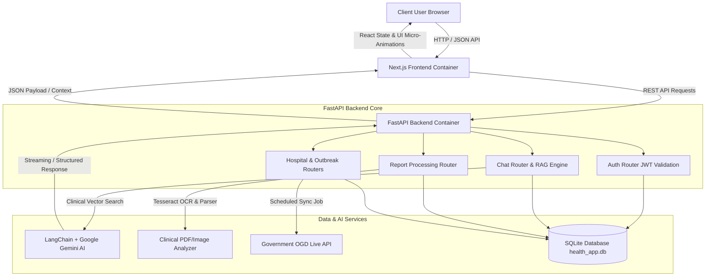

<div align="center">

# 🩺 Health AI Assistant & Outbreak Surveillance System

### *Next-Generation Medical RAG Chatbot, Clinical Report Analysis & Real-Time Disease Surveillance Platform*

[](https://nextjs.org/)
[](https://fastapi.tiangolo.com/)
[](https://www.python.org/)
[](https://www.typescriptlang.org/)
[](https://tailwindcss.com/)
[](https://www.docker.com/)
[](https://ai.google.dev/)
[](LICENSE)

[Features](#-key-highlights) • [Architecture](#%EF%B8%8F-architecture) • [API Routes](#-routing--api-structure) • [Installation](#%EF%B8%8F-local-development) • [Deployment](#-build--deployment)

</div>

---

## 📑 Table of Contents
- [📌 Overview](#-overview)
- [✨ Key Highlights](#-key-highlights)
- [🛠️ Technologies Used](#%EF%B8%8F-technologies-used)
- [🏗️ Architecture](#%EF%B8%8F-architecture)
  - [System Data Pipeline & Flow](#system-data-pipeline--flow)
  - [High-Level Component Architecture](#high-level-component-architecture)
- [🛣️ Routing & API Structure](#%EF%B8%8F-routing--api-structure)
- [🔒 State Management & Authentication](#-state-management--authentication)
- [🗄️ Database Design](#%EF%B8%8F-database-design)
- [🌐 API Integration & Service Layer](#-api-integration--service-layer)
- [🔑 Environment Variables](#-environment-variables)
- [🛠️ Local Development](#%EF%B8%8F-local-development)
- [🚀 Build & Deployment](#-build--deployment)
- [📂 Folder Structure](#-folder-structure)

---

## 📌 Overview

**Health AI Assistant** is a production-ready, full-stack medical chatbot and epidemiological surveillance platform designed to democratize medical information access and disease tracking. Powered by **FastAPI**, **Next.js 16**, and **Google Gemini RAG**, the application enables users to converse with an AI medical assistant, analyze complex clinical laboratory reports via OCR, find nearby healthcare facilities, and monitor real-time government outbreak feeds.

The application features a modern responsive interface with seamless page transitions, customizable themes (Dark/Light Mode), multi-language internationalization, and micro-animations for real-time AI reasoning state feedback.

---

## ✨ Key Highlights

- 🤖 **Context-Aware Medical AI Chat**: Intelligent conversational agent backed by RAG (Retrieval-Augmented Generation) and clinical knowledge sources.
- 📄 **Automated Medical Report Analyzer**: Multi-page OCR processing (Tesseract.js & PyPDF) extracting lab metrics, risk scores, and simplified patient summaries.
- 🔗 **Report-to-Chat Context Transfer**: One-click follow-up option that seamlessly injects complete laboratory report analysis into an active AI chat session.
- 📡 **Real-Time Outbreak Surveillance**: Live government feed integration (OGD API) tracking active epidemiological outbreaks and disease trends.
- 🏥 **Hospital Finder**: Location-aware healthcare directory pinpointing nearby medical facilities, bed availability, and emergency contacts.
- 🎨 **Adorable & Premium UI**: Custom design system featuring glassmorphic interfaces, smooth route page transitions (`PageTransition`), wave loading indicators, and micro-animations.
- 🛡️ **Role-Based Access Control & Security**: JWT authentication with protected routes, guest mode, and encrypted local state management.

---

## 🛠️ Technologies Used

| Technology | Version | Purpose |
| :--- | :--- | :--- |
| **Next.js** | `16.0.6` | App Router Frontend Framework |
| **React** | `19.0.0` | UI Component Library |
| **TypeScript** | `5.x` | Type-Safe Application Code |
| **TailwindCSS** | `4.0` | Utility-First Styling System |
| **FastAPI** | `0.109` | Asynchronous Python Backend API |
| **Python** | `3.13` | Backend Core Runtime Environment |
| **Google Gemini API** | `gemini-1.5-flash` | Generative AI & Clinical RAG Engine |
| **LangChain** | `0.1` | RAG Prompt Orchestration |
| **SQLite / SQLAlchemy** | `3.x` | Relational Persistence Database |
| **Tesseract.js & PyPDF** | `5.x` | OCR Document Processing |
| **Docker & Docker Compose** | `latest` | Multi-Container Containerization |
| **Lucide React** | `0.300+` | Modern UI Vector Icon System |

---

## 🏗️ Architecture

### System Data Pipeline & Flow

The sequence diagram below illustrates the end-to-end data pipeline between the Next.js frontend, FastAPI backend, RAG Knowledge Retrieval Engine, and Government Outbreak Sync Service.



### High-Level Component Architecture

```
+-----------------------------------------------------------------------------------+
|                                 CLIENT BROWSER                                    |
| +-------------------------------------------------------------------------------+ |
| |                        Next.js 16 App Router Frontend                         | |
| | [AuthContext] [ThemeContext] [LanguageContext] [PageTransition Engine]        | |
| | Pages: /dashboard | /chat | /reports | /hospitals | /outbreaks | /admin      | |
| +-------------------------------------------------------------------------------+ |
+----------------------------------------|------------------------------------------+
                                         | REST API calls (Port 8001)
+----------------------------------------v------------------------------------------+
|                            FASTAPI BACKEND CONTAINER                              |
| +-------------------------------------------------------------------------------+ |
| |                              Routers & Handlers                               | |
| | [/api/auth]      [/api/chat]       [/api/reports]    [/api/hospitals]           | |
| +---------------------------------------|---------------------------------------+ |
| |                            Services & Processing                              | |
| | [RAG Engine (Gemini)]   [OCR Report Analyzer]   [OGD Outbreak Sync Job]       | |
| +---------------------------------------|---------------------------------------+ |
| |                              Persistence Layer                                | |
| |                 SQLite Database (data/health_app.db)                          | |
| +-------------------------------------------------------------------------------+ |
+-----------------------------------------------------------------------------------+
```

---

## 🛣️ Routing & API Structure

### Frontend Pages (Next.js App Router)

| Route | Access | Description |
| :--- | :--- | :--- |
| `/` | Public | Interactive landing page with feature showcase |
| `/login` | Public | User authentication login view |
| `/signup` | Public | New account registration form |
| `/dashboard` | Protected | Health overview, stats, recent activities |
| `/chat` | Protected | Real-time AI medical assistant chat interface |
| `/reports` | Protected | Medical report upload, OCR analysis & PDF export |
| `/hospitals` | Protected | Hospital & medical facility locator map view |
| `/outbreaks` | Protected | Real-time disease outbreak surveillance dashboard |
| `/activity` | Protected | User activity log timeline |
| `/profile` | Protected | Account settings & preference management |
| `/admin` | Admin Only | Administrative user management & system status |

### Backend API Endpoints (FastAPI)

| Endpoint | Method | Auth Required | Description |
| :--- | :--- | :--- | :--- |
| `/api/auth/signup` | `POST` | No | Register a new user |
| `/api/auth/login` | `POST` | No | Authenticate user & issue JWT token |
| `/api/auth/me` | `GET` | Yes | Fetch current authenticated user session |
| `/api/chat/sessions` | `GET` | Yes | List active chat sessions for user |
| `/api/chat/sessions` | `POST` | Yes | Create a new chat session |
| `/api/chat/messages` | `POST` | Yes | Send message to AI & retrieve RAG response |
| `/api/reports/analyze` | `POST` | Yes | Upload laboratory report for OCR analysis |
| `/api/hospitals/nearby` | `GET` | Yes | Fetch nearby medical facilities & hospitals |
| `/api/outbreaks/live` | `GET` | Yes | Query active epidemiological outbreak records |

---

## 🔒 State Management & Authentication

State management across the frontend application is powered by React Context APIs:
- **`AuthContext`**: Manages current user session, JWT storage in `localStorage` and `token` cookies for Next.js middleware protection.
- **`ThemeContext`**: Manages light/dark mode preference persistence with CSS variables.
- **`LanguageContext`**: Provides internationalization translations across UI components.
- **`PageTransition`**: Listens to Next.js `usePathname()` route changes to render a top glowing progress bar and smooth route slide-fade transitions.

---

## 🗄️ Database Design

The application uses an asynchronous **SQLite** relational schema via SQLAlchemy:

```
+------------------+       +-------------------+       +--------------------+
|      Users       |       |   Chat Sessions   |       |   Chat Messages    |
+------------------+       +-------------------+       +--------------------+
| id (PK)          |1     *| id (PK)           |1     *| id (PK)            |
| email (Unique)   |<----->| user_id (FK)      |<----->| session_id (FK)    |
| password_hash    |       | title             |       | sender (user/ai)   |
| name             |       | created_at        |       | content            |
| role (user/admin)|       | updated_at        |       | timestamp          |
+------------------+       +-------------------+       +--------------------+
        | 1
        |
        | *
+------------------+       +-------------------+
|  Medical Reports |       |  Outbreak Feeds   |
+------------------+       +-------------------+
| id (PK)          |       | id (PK)           |
| user_id (FK)     |       | disease_name      |
| report_name      |       | location          |
| extracted_text   |       | cases_count       |
| summary_analysis |       | risk_level        |
| created_at       |       | updated_at        |
+------------------+       +-------------------+
```

---

## 🌐 API Integration & Service Layer

The backend integrates three core service handlers:
1. **RAG Engine (`rag_engine.py`)**: Connects to **Google Gemini API** using **LangChain** prompts for clinical answer synthesis.
2. **Medical Report OCR (`report_analyzer.py`)**: Uses **PyPDF** and **Tesseract** to parse uploaded PDF/image lab results, extract metric ranges, and generate structured diagnostic summaries.
3. **Government Data Sync (`ogd_api_client.py`)**: Automated background worker polling real-time disease outbreak feeds and populating active surveillance statistics.

---

## 🔑 Environment Variables

To configure local or docker deployments, create a `.env` file in the project root:

```env
# Backend Configuration
PORT=8001
GEMINI_API_KEY=your_google_gemini_api_key_here
JWT_SECRET_KEY=super_secret_jwt_key_change_in_production
DATABASE_URL=sqlite:////app/data/health_app.db

# Frontend Configuration
NEXT_PUBLIC_API_URL=http://localhost:8001
NEXT_PUBLIC_GOOGLE_MAPS_API_KEY=optional_google_maps_api_key
```

### Variable Details

| Variable | Required | Default Value | Description |
| :--- | :--- | :--- | :--- |
| `GEMINI_API_KEY` | **Yes** | None | API key for Google Gemini AI inference |
| `JWT_SECRET_KEY` | **Yes** | `default_secret` | Secret key used to sign JWT auth tokens |
| `NEXT_PUBLIC_API_URL` | **Yes** | `http://localhost:8001` | Backend REST API endpoint URL |
| `NEXT_PUBLIC_GOOGLE_MAPS_API_KEY` | Optional | `""` | Key for Google Maps hospital finder |

---

## 🛠️ Local Development

### Prerequisites
- **Docker** & **Docker Compose** installed
- **Node.js** `20+` and **Python** `3.13+` (if running outside Docker)

### Installation & Setup

1. **Clone the Repository**:
   ```bash
   git clone https://github.com/Kuldeep-Tapodhan/health-chat-bot-application.git
   cd health-chat-bot-application
   ```

2. **Configure Environment Variables**:
   ```bash
   cp .env.example .env
   # Edit .env and set your GEMINI_API_KEY
   ```

3. **Start Application Containers via Docker Compose**:
   ```bash
   docker compose up --build -d
   ```

4. **Verify Application Access**:
   - **Frontend App**: [http://localhost:3003](http://localhost:3003)
   - **Backend API**: [http://localhost:8001](http://localhost:8001)
   - **Interactive API Docs**: [http://localhost:8001/docs](http://localhost:8001/docs)

### Available Docker Commands

| Command | Action |
| :--- | :--- |
| `docker compose up -d` | Launch containers in detached mode |
| `docker compose up --build -d` | Rebuild images and restart containers |
| `docker compose down` | Stop and remove active containers & networks |
| `docker logs -f health_ai_frontend` | Tail frontend application logs |
| `docker logs -f health_ai_backend` | Tail backend FastAPI server logs |

---

## 🚀 Build & Deployment

### Production Docker Build

To create optimized production images:

```bash
# Build production images
docker compose build --no-cache

# Run production containers
docker compose up -d
```

---

## 📂 Folder Structure

```
health-chat-bot-application/
├── docker-compose.yml              # Multi-container orchestration config
├── README.md                       # Project technical documentation
│
├── backend_fastapi/                # FastAPI Asynchronous Python Backend
│   ├── Dockerfile                  # Python 3.13 production Docker image
│   ├── main.py                     # FastAPI application entrypoint & middleware
│   ├── requirements.txt            # Python dependencies
│   ├── data/                       # SQLite persistent database storage
│   │   ├── health_app.db           # SQLite DB file
│   │   └── hospitals.csv           # Hospital dataset feed
│   ├── routers/                    # Endpoint routers
│   │   ├── auth.py                 # User auth & JWT router
│   │   ├── chat.py                 # RAG AI chat session router
│   │   ├── hospitals.py            # Facility search router
│   │   ├── outbreaks.py            # Disease surveillance router
│   │   └── reports.py              # Clinical report OCR router
│   └── services/                   # Service layer business logic
│       ├── ogd_api_client.py       # Government outbreak sync service
│       ├── rag_engine.py           # Gemini RAG pipeline handler
│       └── report_analyzer.py      # PDF / Image OCR parser
│
└── health-chatbot-app/             # Next.js 16 TypeScript Frontend
    ├── Dockerfile                  # Node 20 multi-stage build Dockerfile
    ├── middleware.ts               # Route guard authentication middleware
    ├── package.json                # Frontend NPM packages
    ├── src/
    │   ├── app/                    # Next.js App Router pages & views
    │   │   ├── page.tsx            # Main landing page
    │   │   ├── layout.tsx          # Root layout with PageTransition
    │   │   ├── globals.css         # Custom Tailwind 4 styling & animations
    │   │   ├── chat/               # AI Chat interface view
    │   │   ├── reports/            # Report upload & analysis view
    │   │   ├── dashboard/          # Health overview dashboard
    │   │   ├── hospitals/          # Hospital finder page
    │   │   ├── outbreaks/          # Outbreak surveillance page
    │   │   └── activity/           # Activity timeline page
    │   ├── components/             # Reusable UI components
    │   │   ├── Header.tsx          # Top navigation header
    │   │   ├── Sidebar.tsx         # Collapsible navigation sidebar
    │   │   ├── ProtectedRoute.tsx  # Auth protection wrapper
    │   │   ├── OutbreakDashboard.tsx# Live surveillance widget
    │   │   └── ui/                 # Core visual UI components
    │   │       ├── PageTransition.tsx# Route transition progress bar
    │   │       └── ToastProvider.tsx# Notification toast system
    │   ├── contexts/               # React Context providers
    │   │   ├── AuthContext.tsx     # Authentication state provider
    │   │   ├── ThemeContext.tsx    # Light/Dark mode state provider
    │   │   └── LanguageContext.tsx # Multi-language i18n provider
    │   └── lib/
    │       └── api-client.ts       # Typed API client & request wrappers
```

---

<div align="center">

Built with Next.js 16, FastAPI, LangChain, Google Gemini & Docker 🚀

</div>
