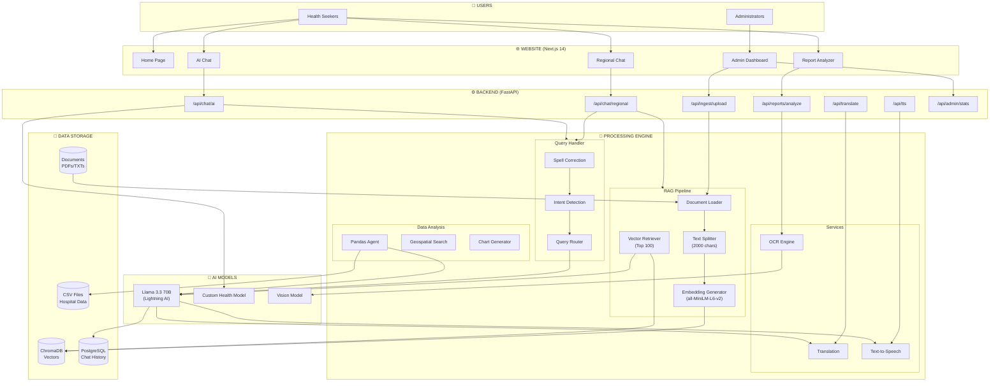
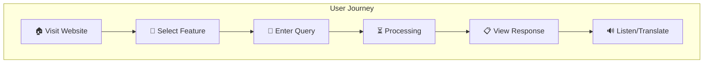
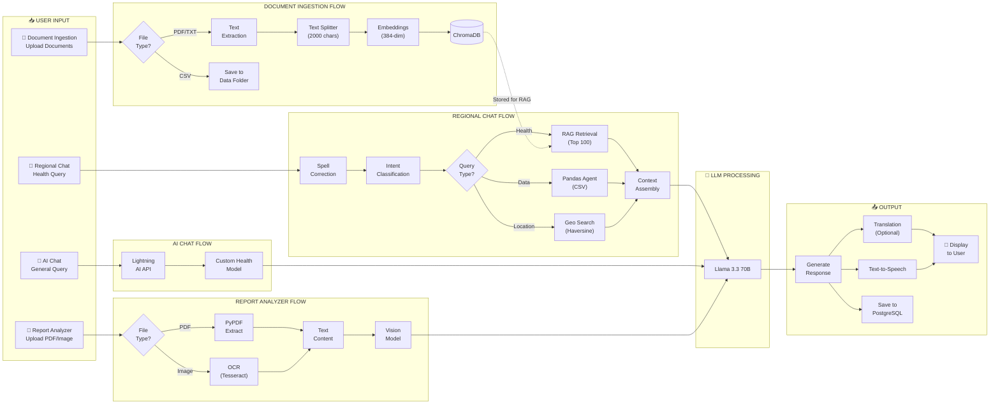
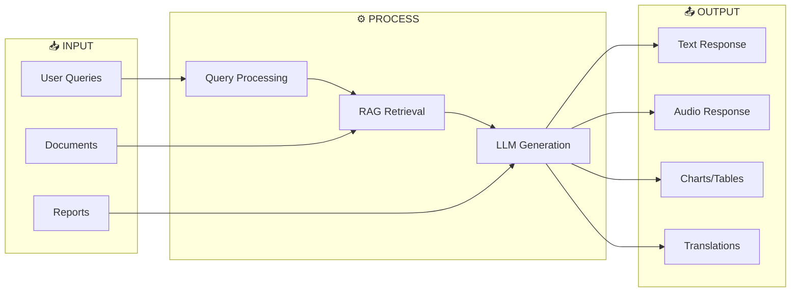
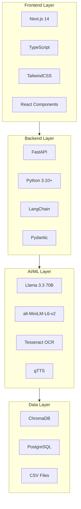
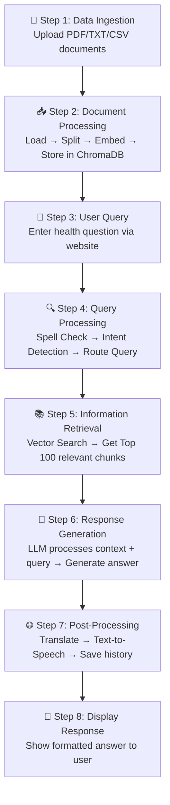

# Regional Health Assistance Chatbot - Process Diagram

> **Research Paper Documentation**  
> Complete Website Process Flow and System Architecture

---

## 1. Complete System Process Flow

---

## 2. User Journey Flow

---

## 3. Feature Process Flow (Combined)

---

## 4. Data Flow Diagram

---

## 5. Technology Architecture

---

## 6. API Endpoints Summary

| Endpoint | Method | Purpose |
|----------|--------|---------|
| `/api/chat/regional` | POST | RAG-based health Q&A |
| `/api/chat/ai` | POST | Direct AI conversation |
| `/api/reports/analyze` | POST | Medical report analysis |
| `/api/ingest/upload` | POST | Document ingestion |
| `/api/translate` | POST | Multi-language translation |
| `/api/tts` | POST | Text-to-speech conversion |
| `/api/admin/stats` | GET | Dashboard statistics |

---

## 7. Simplified Linear Process

---

## 8. System Components Table

| Component | Technology | Description |
|-----------|------------|-------------|
| **Website** | Next.js 14 | React-based frontend with TypeScript |
| **API Server** | FastAPI | High-performance Python backend |
| **Vector Database** | ChromaDB | Store and retrieve document embeddings |
| **User Database** | PostgreSQL | Chat history and user sessions |
| **LLM** | Llama 3.3 70B | Primary language model via Lightning AI |
| **Embeddings** | all-MiniLM-L6-v2 | 384-dimensional sentence embeddings |
| **Translation** | LLM-based | Multi-language support (Hindi, Gujarati, etc.) |
| **TTS** | gTTS | Convert text responses to audio |
| **OCR** | Tesseract | Extract text from images |

---

## 9. Security & Performance

| Aspect | Implementation |
|--------|----------------|
| **API Security** | CORS, Rate Limiting |
| **Data Privacy** | Local vector storage |
| **Performance** | Streaming responses |
| **Scalability** | Async FastAPI endpoints |
| **Caching** | ChromaDB persistence |

---
