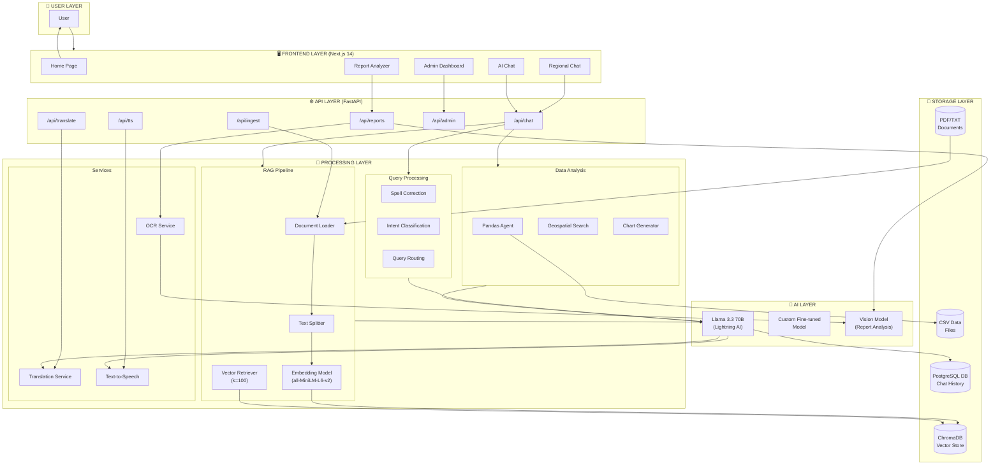
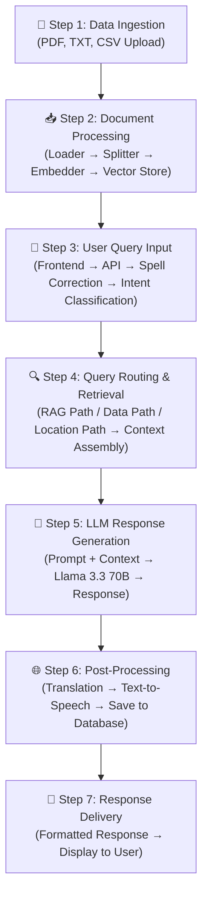

# Regional Health Assistance Chatbot - Full Project Documentation

> **Research Paper Reference Document**  
> Complete System Architecture and Process Flow

---

## Full Project Process Diagram



---

## Detailed Process Flow



---

## Feature Modules

| Module | Description | Technologies |
|--------|-------------|--------------|
| **Regional Chat** | RAG-based health Q&A with regional language support | ChromaDB, Llama 3.3, Translation API |
| **AI Chat** | Direct conversation with custom-trained health model | Lightning AI, Custom Model |
| **Report Analyzer** | OCR-based medical report analysis | Tesseract, Vision Model |
| **Admin Dashboard** | System monitoring and statistics | PostgreSQL, FastAPI |
| **Document Ingestion** | Upload and process health documents | PyPDF, LangChain |

---

## Technical Stack

| Layer | Technology | Purpose |
|-------|------------|---------|
| **Frontend** | Next.js 14, TypeScript, TailwindCSS | User Interface |
| **Backend** | FastAPI, Python 3.10+ | API Server |
| **Vector DB** | ChromaDB | Document Embeddings |
| **Embedding** | all-MiniLM-L6-v2 (384 dim) | Text Vectorization |
| **LLM** | Llama 3.3 70B (Lightning AI) | Response Generation |
| **Database** | PostgreSQL | Chat History, User Data |
| **Translation** | Llama-based Translation | Multi-language Support |
| **TTS** | gTTS | Audio Response |

---

## System Flow Summary

```
┌─────────────────────────────────────────────────────────────────────────┐
│                    REGIONAL HEALTH ASSISTANCE CHATBOT                    │
├─────────────────────────────────────────────────────────────────────────┤
│                                                                          │
│   👤 USER                                                                │
│      │                                                                   │
│      ▼                                                                   │
│   ┌──────────────────────────────────────────────────────────────┐      │
│   │  FRONTEND (Next.js)                                          │      │
│   │  • Regional Chat  • AI Chat  • Report Analyzer  • Admin      │      │
│   └──────────────────────────────────────────────────────────────┘      │
│      │                                                                   │
│      ▼                                                                   │
│   ┌──────────────────────────────────────────────────────────────┐      │
│   │  BACKEND (FastAPI)                                           │      │
│   │  • Chat API  • Ingest API  • Report API  • Translate API     │      │
│   └──────────────────────────────────────────────────────────────┘      │
│      │                                                                   │
│      ▼                                                                   │
│   ┌──────────────────────────────────────────────────────────────┐      │
│   │  PROCESSING                                                   │      │
│   │  • RAG Pipeline  • Query Routing  • Data Analysis            │      │
│   └──────────────────────────────────────────────────────────────┘      │
│      │                                                                   │
│      ▼                                                                   │
│   ┌──────────────────────────────────────────────────────────────┐      │
│   │  AI MODELS                                                    │      │
│   │  • Llama 3.3 70B  • Custom Model  • Vision Model             │      │
│   └──────────────────────────────────────────────────────────────┘      │
│      │                                                                   │
│      ▼                                                                   │
│   ┌──────────────────────────────────────────────────────────────┐      │
│   │  STORAGE                                                      │      │
│   │  • ChromaDB  • PostgreSQL  • CSV Files  • Documents            │      │
│   └──────────────────────────────────────────────────────────────┘      │
│                                                                          │
└─────────────────────────────────────────────────────────────────────────┘
```

---

## Core Components

### 1. Document Ingestion (`backend_fastapi/routers/ingest.py`)

Handles uploading and processing documents:

| File Type | Processing Action |
|-----------|-------------------|
| **PDF** | Ingested into ChromaDB vector store |
| **TXT** | Ingested into ChromaDB vector store |
| **CSV** | Saved to `data/` folder for Pandas analysis |

**Endpoint:** `POST /api/ingest/upload`

---

### 2. RAG Service (`backend_fastapi/services/rag_service.py`)

The **heart of the RAG pipeline**:

| Function | Purpose |
|----------|---------|
| `ingest_document()` | Loads PDF/TXT → Splits into chunks → Adds to ChromaDB |
| `get_vectorstore()` | Returns ChromaDB instance with cosine similarity |
| `get_retriever()` | Returns a retriever that fetches top 100 relevant chunks |

**Key Configuration:**
- **Embedding Model:** `all-MiniLM-L6-v2` (HuggingFace) - runs locally
- **Chunk Size:** 2000 characters
- **Chunk Overlap:** 400 characters
- **Vector DB:** ChromaDB (persisted at `backend_fastapi/chroma_db/`)
- **Similarity Metric:** Cosine

---

### 3. Chat Router (`backend_fastapi/routers/chat.py`)

**Query Processing Flow:**
1. **Spell Correction** - Uses LLM to fix typos
2. **Intent Detection** - Determines query type
3. **Query Routing:**
   - **Data Queries** → Pandas DataFrame Agent
   - **General Questions** → RAG Chain with vector retrieval

**LLM:** `lightning-ai/llama-3.3-70b` via Lightning AI API

---

### 4. Data Service (`backend_fastapi/services/data_service.py`)

Manages CSV files for structured data analysis:
- Lists available CSV files
- Provides file paths for Pandas agent
- Contains `hospital_data.csv` with hospital location data

---

## Query Processing Modes

### Mode 1: RAG Mode (General Health Questions)
```
User: "What are the symptoms of dengue?"
         ↓
    Vector Search (k=100)
         ↓
    Retrieve relevant PDF chunks
         ↓
    LLM generates answer with context
```

Uses `ConversationalRetrievalChain` with:
- Custom prompts for detailed/concise responses
- Chat history support
- Domain restriction (health topics only)

### Mode 2: Data Mode (Hospital/Analytics Queries)
```
User: "Find hospitals within 5km of Nanavati Chowk"
         ↓
    Intent Extraction (nearby_search)
         ↓
    Geocoding + Haversine Distance Calculation
         ↓
    Filtered Markdown Table Response
```

Uses `create_pandas_dataframe_agent` for:
- Direct queries on CSV data
- Chart generation (ChartJS-compatible JSON)
- Geospatial search with fast-path optimization

---

## Vector Database Structure

```
backend_fastapi/chroma_db/
├── chroma.sqlite3       # SQLite database for metadata
└── <collection-id>/     # Collection data
```

Stores:
- Document embeddings (384-dimensional vectors)
- Document metadata (source file, page number)
- Full text content for retrieval

---

## Key Libraries

| Library | Purpose |
|---------|---------|
| `langchain` | RAG chain orchestration, agents |
| `langchain-community` | Document loaders, ChromaDB |
| `langchain-openai` | LLM interface |
| `chromadb` | Vector database |
| `sentence-transformers` | HuggingFace embeddings |
| `pandas` | Data analysis agent |
| `geopy` | Geocoding for location queries |

---

## Summary

This RAG pipeline is a **hybrid system** that:
1. **Ingests** health-related PDFs/TXTs into a vector database
2. **Routes** queries between vector search and pandas agents
3. **Retrieves** context from 127+ health documents
4. **Generates** answers using Llama 3.3 70B
5. **Supports** geospatial queries, charts, and multi-language responses
